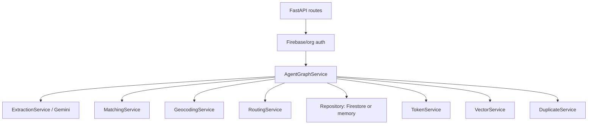
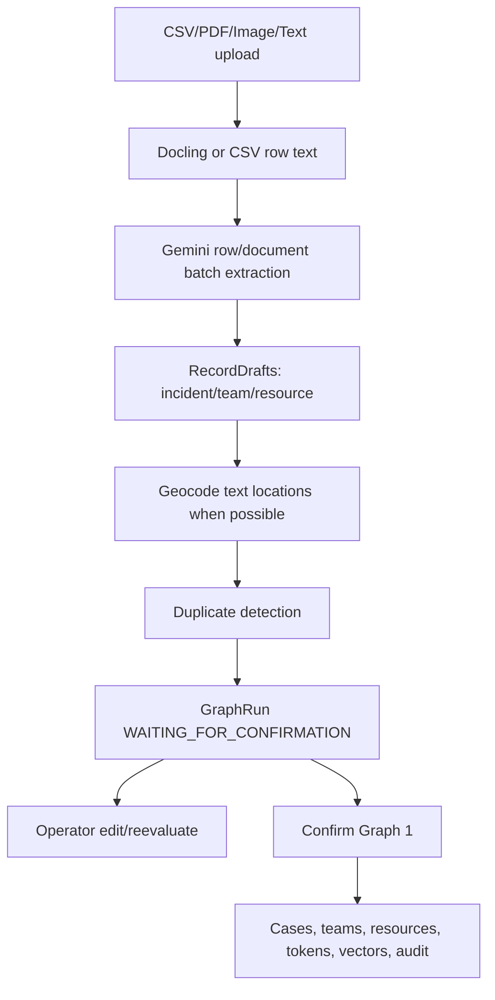
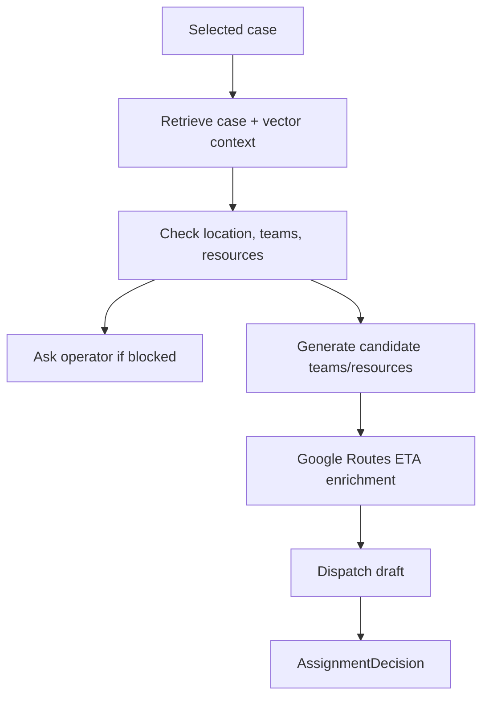
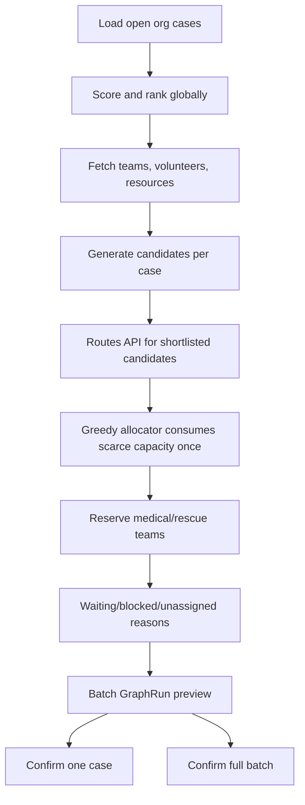
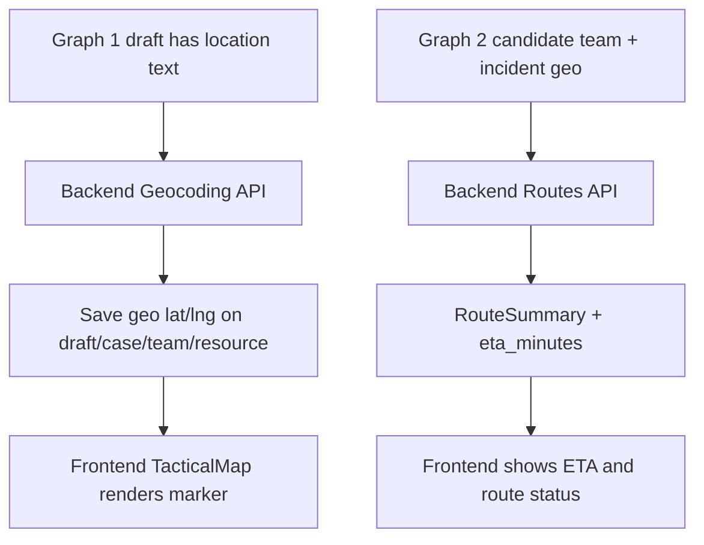
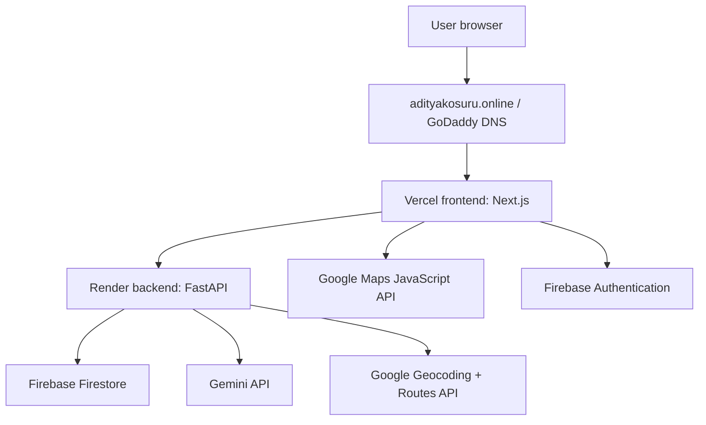

# GDG - Smart Resource Allocation project

By Kosuru Venkata Sai Aditya

## 1. Problem statement

During disasters, NGOs and local response teams receive information from many different sources: WhatsApp messages, CSV sheets, PDF reports, field notes, images, maps, and operational spreadsheets. The problem is not only extracting incidents from this data, but also deciding how to allocate limited teams, volunteers, vehicles, medical kits, boats, food, fuel, shelter supplies, and other resources across many open cases at the same time.

Most emergency tools treat each case independently. That works for simple demos, but real operations are different. A team assigned to one flood rescue case cannot also be assigned to another case at the same time. A limited ambulance, rescue boat, or medical kit must be consumed carefully. A lower-priority case may need to wait if a higher-risk case requires the same resource.

ReliefOps AI solves this by combining AI-assisted intake with deterministic dispatch planning. The system reads messy operational data, generates editable previews, lets an operator correct the output, and only commits data after confirmation. Then it plans dispatches globally, across all open cases and all available assets, instead of recommending resources one case at a time.

The core goals are:

- Convert unstructured NGO data into structured incidents, teams, and resources.
- Keep humans in control through preview, edit, reevaluate, and confirm workflows.
- Use AI for understanding messy data, not for silently changing operational truth.
- Use deterministic backend logic for assignment feasibility, resource stock, route ETA, and confirmation.
- Support both online cloud AI and local/offline model workflows.

## 2. Project Structure

The project is divided into a frontend web console and a backend API service.

ReliefOps AI
├── web/
│   ├── src/app/
│   ├── src/components/
│   ├── src/lib/
│   └── tests/
│
├── api/
│   ├── app/api/routes/
│   ├── app/core/
│   ├── app/models/
│   ├── app/repositories/
│   └── app/services/
│
├── docs/
│   └── schemas/
│
└── test_inputs/

The frontend is a Next.js operator dashboard. It handles login, organization selection, imports, command center views, cases, teams, resources, volunteers, maps, and dispatch planning.

The backend is a FastAPI service. It owns authentication, organization scoping, Graph 1 intake, Graph 2 dispatch planning, model extraction, geocoding, routing, Firestore persistence, duplicate checks, token creation, and vector indexing.

The system is designed around a simple rule:

`Frontend = review and operate 
 Backend = validate, plan, persist, and protect data 
 AI = assist extraction and reevaluation 
 Human = confirm before operational records are committed`

## 3. Frontend

The frontend is the operator-facing console. It is built as a SaaS-style dashboard where NGO staff can import data, review AI-generated drafts, manage operational entities, and run dispatch planning.

The frontend does not directly mutate backend data without going through API helpers. All API calls are centralized through the frontend API layer.

The main frontend responsibilities are:

- Authenticate the user using Firebase Auth.
- Store the active organization in session state.
- Attach Authorization and X-Org-Id headers to backend requests.
- Render import previews from Graph 1.
- Render dispatch plans from Graph 2.
- Let operators edit, reevaluate, remove, confirm, and export plans.
- Show map markers for incidents, teams, resources, and dispatches.
- Refresh dashboard data after mutations.

The API helper design gives the frontend one clean integration contract. Instead of every page writing its own fetch, pages call functions such as:

`runGraph1File(...)
editGraph1(...)
confirmGraph1(...)
runGraph2Batch(...)
editGraph2BatchCase(...)
confirmGraph2Batch(...)`

Advantages of this design:

- Auth headers are consistent.
- Organization scoping is consistent.
- Cache invalidation happens after mutations.
- Error messages are normalized.
- Session expiry can be handled globally.
- Pages stay focused on user experience rather than request details.

Disadvantages:

- Frontend and backend types must stay synchronized manually.
- The cache layer is simple and not as powerful as a full query client.
- If the central helper has a bug, many screens can be affected.
- Long AI operations still require careful loading states and retry UX.

What makes the frontend unique is the preview-first workflow. The user does not simply upload a CSV and trust the model blindly. Instead, the frontend shows editable drafts, source provenance, warnings, confidence, changed fields, and confirmation controls.

## 4. Backend

The backend is the operational brain of ReliefOps AI. It is responsible for correctness, security, and persistence.

The backend is structured around routes, services, repositories, and Pydantic domain models.

The backend’s most important design decision is separating AI understanding from operational truth.

AI can suggest structured fields, explanations, and reevaluation patches. But the backend still owns:

- Resource stock arithmetic.
- Team and volunteer availability.
- Dispatch feasibility.
- Route ETA truth.
- Organization isolation.
- Final confirmation.
- Firestore persistence.

### 4. 1. API

The public API is organized around operational routes and agent graph routes.

Important route groups include:

`/me 
 /health 
 /ai/status 
 /incidents 
 /teams 
 /volunteers 
 /resources 
 /dispatches 
 /ingestion-jobs 
 /organizations 
 /agent/graph1/* 
 /agent/graph2/*`

Graph 1 routes:

`POST /agent/graph1/run 
 POST /agent/graph1/run-file 
 POST /agent/graph1/run/{run_id}/edit 
 POST /agent/graph1/run/{run_id}/remove 
 POST /agent/graph1/run/{run_id}/confirm`

Graph 2 routes:

`POST /agent/graph2/run 
 POST /agent/graph2/batch-run 
 POST /agent/graph2/run/{run_id}/resume 
 POST /agent/graph2/run/{run_id}/edit 
 POST /agent/graph2/run/{run_id}/edit-case 
 POST /agent/graph2/run/{run_id}/replan-global 
 POST /agent/graph2/run/{run_id}/confirm-case 
 POST /agent/graph2/run/{run_id}/confirm-batch`

The API is designed around GraphRun sessions. A GraphRun stores the graph name, run status, source artifacts, editable drafts, user questions, answers, committed IDs, and metadata.

This gives the system a reviewable audit trail:

`Input source 
 -> GraphRun 
 -> Drafts 
 -> Operator edits 
 -> Confirmation 
 -> Persisted operational records` 

### 4.2. Langgraph Pipelining

The backend uses a graph-style pipeline for both intake and dispatch. The graph structure makes each stage explicit and easier to reason about.

Graph 1 is the source-to-operational-records graph.

Graph 1 can extract:

- Incidents.
- Response teams.
- Volunteers or team-like entities.
- Resources and inventory.
- Mixed records from the same file.
- Location text or coordinates.
- Required resources.
- Confidence and warnings.

Graph 2 is the dispatch planning graph.

Single-case Graph 2 works like this:

Batch Graph 2 works globally across open cases:

This batch design is important because it avoids the common mistake of planning each case independently. In real operations, the planner must understand scarcity across all cases.

### 4.3. Fallbacks

ReliefOps supports multiple fallback layers.

AI fallback order can be configured through environment variables. In production, Gemini can be the main provider. In local development, Gemma 4 through Ollama can be used. If model calls fail, the backend can fall back to heuristic extraction.

Typical provider order:

`Production: 
 Gemini -> heuristic

 Local/offline development: 
 Gemma 4 / Ollama -> heuristic 

 Auto mode: 
 Gemini -> Gemma 4 / Ollama -> heuristic`

Fallbacks exist in multiple parts of the system:

- Extraction fallback: Gemini, Gemma/Ollama, heuristic.
- JSON repair fallback: model output is coerced and validated.
- Geocoding fallback: known seeded locations or editable unknown location.
- Routing fallback: approximate route summaries when Routes API is unavailable.
- Map UI fallback: local tactical map if Google Maps JavaScript fails.
- Repository fallback: memory repository for local development, Firestore for deployment.

The advantage is resilience. The app can still be demonstrated or tested locally even when cloud APIs are unavailable.

The disadvantage is that fallback output may be less accurate. That is why the app keeps the review-first workflow. Operators can inspect and correct drafts before committing.

### 4.4. Google Map

Google Maps is used in two separate ways.

Frontend maps use the browser Maps JavaScript API. This key is public and should be restricted to the deployed frontend domain.

Backend maps use private server-side APIs:

- Geocoding API.
- Routes API.

The frontend key should never be used for backend geocoding or routing. The backend key should never be exposed through NEXT_PUBLIC_*.

How maps work in Graph 1:

`Location text from source 
-> backend geocoding 
-> lat/lng saved on draft 
-> operator confirms 
-> lat/lng saved on incident/team/resource
-> frontend map displays marker`

How maps work in Graph 2:

`Incident geo + team geo 
-> backend Routes API 
-> distance and ETA 
-> recommendation enriched 
-> frontend dispatch planner displays ETA`

The system also supports fallback route summaries. If Routes API fails or coordinates are missing, the backend returns a route status such as:

`fallback 
 missing_origin 
 missing_destination 
 failed`

This allows the frontend to keep the workflow alive instead of crashing.

### 4.5 Firestore

Firestore is the production database. The backend repository layer abstracts persistence so local development can use memory storage and production can use Firestore.

Main Firestore-backed entities include:

- User profiles.
- Organizations.
- Organization memberships.
- Cases/incidents.
- Teams.
- Volunteers.
- Resources.
- Dispatch assignments.
- Ingestion jobs.
- Graph runs.
- Evidence metadata.
- Info tokens.
- Vector records.
- Geocode cache.
- Audit events.

Firestore gives the project:

- Cloud persistence.
- Organization-scoped data.
- Easy deployment with Firebase/Google Cloud.
- Integration with Firebase Auth identities.
- Good fit for document-based operational records.

Important constraint:

Firestore documents have a maximum size limit. Because GraphRun previews can become large, the backend compacts source text, row data, warnings, provenance, and draft payloads before saving.

This is especially important for large CSV/PDF imports.

## 5. Deployment

The project can be deployed with the frontend and backend as separate services.

The main deployment principle is:

`Frontend gets only public NEXT_PUBLIC_* variables. 
 Backend gets private secrets and server API keys.`

### 5.1. frontnend (Vercel,AdityaKosuru Domain godaddy)

The frontend can be deployed on Vercel as a Next.js app.

Required frontend environment variables:

`NEXT_PUBLIC_API_BASE_URL=https://<render-backend-url> 
 NEXT_PUBLIC_ENABLE_DEMO_AUTH=false 
 NEXT_PUBLIC_FIREBASE_API_KEY=<firebase-web-api-key> 
 NEXT_PUBLIC_FIREBASE_APP_ID=<firebase-web-app-id> 
 NEXT_PUBLIC_FIREBASE_AUTH_DOMAIN=<project>.firebaseapp.com 
 NEXT_PUBLIC_FIREBASE_PROJECT_ID=<firebase-project-id> 
 NEXT_PUBLIC_FIREBASE_STORAGE_BUCKET=<bucket>.firebasestorage.app 
 NEXT_PUBLIC_GOOGLE_MAPS_API_KEY=<browser-maps-js-key>`

The GoDaddy domain points to Vercel by updating DNS records. Usually this means adding Vercel-provided records such as:

`A record / CNAME record 
 Domain: adityakosuru.online 
 Target: Vercel-provided target`

The frontend deployment checklist:

- Add production environment variables in Vercel.
- Deploy the Next.js app.
- Add the custom domain in Vercel.
- Update GoDaddy DNS.
- Add the custom domain to Firebase Authentication authorized domains.
- Restrict the frontend Google Maps key to the Vercel/custom domain.
- Confirm /health, /me, and /ai/status work from the hosted frontend.

### 5.2. backend (Rendere)

The backend can be deployed as a FastAPI service on Render.

Required backend environment variables:

`APP_ENV=production 
 REPOSITORY_BACKEND=firestore 
 ALLOW_DEMO_AUTH=false 
 FIREBASE_PROJECT_ID=<firebase-project-id> 
 FIREBASE_STORAGE_BUCKET=<bucket>.firebasestorage.app 
 AI_PROVIDER=gemini 
 GEMINI_ENABLED=true 
 GEMMA4_ENABLED=false 
 GEMINI_API_KEY=<private-gemini-key> 
 GOOGLE_MAPS_API_KEY=<private-backend-maps-key> 
 CORS_ORIGINS=["https://<vercel-domain>","https://adityakosuru.online"]` 

The backend deployment checklist:

- Deploy the FastAPI service on Render.
- Configure environment variables.
- Add Firebase service credentials or Application Default Credentials equivalent.
- Enable Firestore access.
- Enable Gemini API.
- Enable Geocoding API and Routes API.
- Add Vercel/custom frontend URLs to backend CORS.
- Test /health.
- Test /ai/status.
- Test login through frontend /me.
- Upload a CSV/PDF and confirm Graph 1.
- Run batch dispatch planning and confirm Graph 2.

## 6. Offline and online capablities

ReliefOps is designed to work in both cloud-first and local-development modes, but the level of capability changes depending on what is available.

Online mode gives the full experience:

- Firebase Authentication.
- Firestore persistence.
- Firebase Storage.
- Gemini API extraction.
- Google Geocoding.
- Google Routes ETA.
- Google Maps JavaScript rendering.
- Hosted frontend/backend deployment.

Offline or local mode can still support:

- Local frontend and backend.
- Memory repository.
- Local Gemma 4 through Ollama.
- Heuristic fallback extraction.
- Local tactical map fallback.
- Approximate route fallback based on coordinates.

However, some features are naturally online:

- Firebase login.
- Firestore sync.
- Google Maps tiles.
- Geocoding from addresses.
- Live route ETA.
- Gemini API calls.

### 6.1 Gemma 4

Gemma 4 can be used locally through Ollama for offline or low-cost development.

Its role is to support:

- Incident extraction.
- Team/resource extraction.
- Unknown CSV row understanding.
- Prompt-based reevaluation.
- Structured JSON generation.
- Local testing without spending Gemini credits.

Typical local configuration:

`AI_PROVIDER=ollama 
 GEMMA4_ENABLED=true 
 OLLAMA_BASE_URL=http://127.0.0.1:11434 
 OLLAMA_MODEL=gemma4:e2b`

Benefits:

- Lower cost during development.
- Works without cloud model calls.
- Useful for demos and debugging.
- Keeps the same backend extraction contract.

Limitations:

- Output may be less consistent than Gemini.
- Requires local Ollama setup.
- Slower on low-resource machines.
- Not ideal for production scale.

### 6.2 API calls to larger better models

For production or higher-quality extraction, ReliefOps can call larger cloud models through Gemini.

Gemini handles the same role as the local model:

- CSV/PDF/text/image extraction.
- Mixed entity extraction.
- Incident, team, and resource draft creation.
- Reevaluation prompts.
- Structured JSON output.
- Full-context patch generation.

The model is not used as an uncontrolled agent. It must return structured data matching backend schemas. The backend then validates and coerces the result.

The safety boundary is:

`Gemini may: 
- extract fields 
- suggest patches 
- improve explanations 
- summarize warnings 

Gemini may not: 
- directly commit records 
- consume inventory 
- bypass team availability 
- invent route ETA 
- override organization security 
- confirm dispatches`

This design gives the system the flexibility of AI while preserving backend correctness.

## 7. Evaluation

Evaluation focused on whether the system can understand different real-world data formats and whether it can produce useful operational records.

The system was tested on:

- Custom-made CSV datasets.
- Unstructured incident reports.
- Mixed incident/team/resource files.
- Location text without coordinates.
- Rows with coordinates.
- Actual NGO-style operational data.
- Dispatch scenarios with scarce teams and resources.

### 7.1 Tested on coustom made datasets and ran the model on unstructured dataset

Custom datasets were created to test the full workflow:

`CSV upload 
-> AI extraction 
-> editable preview 
-> reevaluation 
-> confirmation 
-> dashboard update 
-> dispatch planning`

The datasets included:

- Flood rescue cases.
- Fire incidents.
- Medical emergency cases.
- Water shortage reports.
- Shelter shortage records.
- Teams with different capabilities.
- Resources with limited stock.
- Missing locations.
- Ambiguous locations.
- Mixed records in one file.

The goal was not just to check if the model could extract text. The goal was to check if the whole system could move from messy input to operational action.

Example evaluation questions:

- Does the model detect incidents when headers are unfamiliar?
- Can the model extract locations written in words?
- Can the system preserve coordinates when they exist?
- Can operators correct wrong fields?
- Does reevaluation update structured payloads?
- Does Graph 2 avoid double-booking the same team?
- Are unassigned cases explained clearly?

### 7.2 Ran on aclutal NGO Data

The project was also tested on real NGO-style data. This type of data is usually not clean. It may contain inconsistent columns, incomplete fields, address-like locations, mixed resource descriptions, duplicate entries, and operational notes written for humans rather than machines.

The actual NGO data helped validate the most important design decision: a parser-only system is not enough. Real files require AI-assisted understanding, but the output must still be reviewable.

The tested workflow was:

`Actual NGO source file 
-> Graph 1 extraction 
-> human review 
-> corrections through prompt/field edits 
-> confirmation into Firestore 
-> command center update 
-> Graph 2 dispatch planning 
-> single-case or batch dispatch confirmation` 

This showed that the preview-first approach is necessary. AI output can be useful, but operators need visibility into what was extracted, why it was extracted, and what still needs review.

## 8.  Project Analysis

ReliefOps AI is strongest because it combines AI flexibility with deterministic operational rules.

The project is not just a chatbot and not just a CRUD dashboard. It is a decision-support system with two major graph workflows:

`Graph 1 = understand messy operational data 
 Graph 2 = allocate scarce assets safely`

The best architectural choices are:

- Preview-first ingestion.
- Human confirmation before persistence.
- Centralized frontend API helper.
- Firebase-based authentication.
- Organization-scoped backend security.
- Structured Pydantic models.
- Firestore repository abstraction.
- Gemini/Gemma/heuristic provider fallback.
- Deterministic dispatch planning.
- Backend-owned geocoding and routing.
- Full-context reevaluation with validated patches.

The main tradeoffs are:

- The system is more complex than a simple upload-and-save app.
- AI outputs still require operator review.
- Firestore document size limits require compaction.
- Frontend/backend types must be kept synchronized.
- Google Maps, Gemini, Firebase, and Firestore require careful key and CORS setup.
- Offline mode is useful, but not equal to full cloud mode.

The most important final idea is this:

`ReliefOps AI does not replace the operator. 
 It gives the operator a structured, explainable, editable planning workspace.`

### **8.1 How is the different from other existing solutions?**

Most relief tools track incidents after they are created. ReliefOps AI actively turns chaotic incoming information into prioritized, geo-aware, resource-matched dispatch decisions.

It combines multiple hard parts into one operational flow:

- **Unstructured-to-actionable triage:** field reports, CSVs, PDFs, or images become structured incidents.
- **Maps-first decision-making:** incidents, teams, resources, routes, and ETAs are central to the workflow.
- **Smart prioritization:** emergencies are scored based on life threat, time sensitivity, vulnerability, scale, and sector severity.
- **Duplicate detection:** repeated reports about the same crisis are flagged instead of creating confusion.
- **Resource-aware dispatch:** the system recommends teams based on skills, availability, ETA, capacity, workload, resources, and reliability.
- **Human-in-the-loop safety:** AI proposes, but a coordinator confirms before real dispatch.
- **Future autonomous agent layer:** LangGraph can turn the current pipeline into a multi-agent system that can enrich, reason, ask clarifying questions, and re-plan.

### **8.2 How large of a impact can the solution really make?**

The solution can make meaningful impact wherever emergency coordination suffers from fragmented inputs, delayed triage, or poor visibility into resources. Even if it is first deployed at the NGO, district, hospital-network, or city-control-room level, it can reduce the time needed to understand incidents, avoid duplicate response efforts, and improve how limited teams and resources are allocated.

Its strongest impact is operational rather than theoretical. Faster classification, better prioritization, and clearer dispatch recommendations can directly improve response quality during floods, health emergencies, infrastructure failures, and humanitarian relief operations. In high-pressure situations, even small time savings and fewer coordination errors can have serious real-world value.

### **8.3 Define the USP of the project**

The USP of ReliefOps AI is:

**A maps-first, AI-assisted emergency coordination system that converts chaotic incident inputs into explainable, resource-matched dispatch decisions.**

In one line:

**From chaotic reports to coordinated response.**

What makes this USP credible is the combination of multi-source intake, AI triage, geospatial context, duplicate detection, resource-aware matching, and human-in-the-loop approval in one workflow.

### **8.4 How scalable is the solution really?**

The solution is highly scalable in architecture, because it is based on modular services and a serverless cloud model. The frontend can scale independently, the backend can scale on demand through Cloud Run, and Firestore supports growth in operational data without requiring traditional server management. This makes it suitable for starting as a pilot and expanding to larger multi-team or multi-region deployments.

It is also scalable functionally. New data connectors, new AI models, and future LangGraph agents can be added without redesigning the whole product. The main scaling challenges are not only technical, but also organizational: clean operational data, adoption by field teams, governance, multilingual support, and cost control for heavy API usage.

### **8.5 What are additional features and functionality that can be added upon the already existing MVP?**

- Live weather, alert, and humanitarian feed integration.
- Hospital, shelter, and facility directory integration.
- WhatsApp, SMS, email, and chatbot-based incident intake.
- Multilingual extraction and translation for regional languages.
- Real GIS maps with route overlays and live movement tracking.
- LangGraph-based specialist agents for intake, enrichment, planning, and re-planning.
- Background job queues for large imports and document processing.
- Post-dispatch monitoring with automatic re-routing suggestions.
- Offline-first field responder app for low-connectivity environments.
- Role-based access control, compliance logs, and exportable audit reports.
- Predictive hotspot analysis and demand forecasting.
- Better analytics for response time, bottlenecks, and resource utilization.

### **8.6 What would the estimated cost of running the project over a long term be?**

The long-term cost is likely to be moderate for a pilot and manageable at NGO or city scale, with the main cost drivers being **Google Maps usage** and **LLM usage**, not the base hosting itself.

A practical estimate for the target cloud architecture is:

- **Pilot / small NGO deployment:** roughly **$20 to $80 per month**.
- **Moderate city / district deployment:** roughly **$100 to $400 per month**.
- **Large multi-partner deployment:** roughly **$500 to $2,000+ per month**, depending on API volume.

This range is reasonable because:

- **Cloud Run** has an always-free tier, then charges for CPU, memory, and requests; the base backend cost stays relatively low for typical MVP usage.
- **Firestore** also has a generous free tier and usually remains inexpensive unless read/write volume becomes very large.
- **Firebase Authentication** is mostly no-cost for standard auth methods; phone auth is the main paid exception.
- **Google Maps** can become a major cost driver because Geocoding and Routes are charged per request after free usage caps.
- **Gemini** costs depend heavily on model choice and token volume; using Flash or Flash-Lite keeps costs much lower than larger reasoning models.

These costs can be reduced significantly through caching, batching, only routing high-priority incidents, and using lower-cost models for first-pass triage.

### **8.7 Who really is the target audience for the solution?**

The primary target audience is organizations that coordinate emergency response but struggle with fragmented information and limited operational visibility.

The most relevant users are:

- disaster management authorities
- NGOs and humanitarian response organizations
- hospital emergency coordination teams
- ambulance and medical referral networks
- municipal command centers
- district or state-level emergency control rooms
- relief logistics teams handling shelters, food, water, and supplies

In practice, the best first adopters would likely be NGOs, district-level coordination teams, and hospital-linked emergency desks, because they have urgent coordination needs but often lack integrated triage and dispatch tools.

### **8.8 How relavent and future proof will be the solution be in the next 10 years?**

The solution is highly relevant and likely to remain so over the next decade because the problem it addresses is not temporary. Climate-linked disasters, urban flooding, infrastructure stress, migration, public health emergencies, and humanitarian coordination challenges are expected to increase rather than disappear. Systems that can improve triage, coordination, and resource allocation will become more important, not less.

It is also future-proof from a technical perspective because the architecture is modular. Models can be upgraded, connectors can be replaced, new data sources can be added, and LangGraph-based orchestration can evolve without rebuilding the whole platform. The core need, converting scattered crisis signals into coordinated operational decisions, is durable.

The main condition for long-term future-proofing is responsible evolution. To remain useful over 10 years, the solution must keep human oversight, support multilingual and low-connectivity environments, follow strong data governance, and remain interoperable with public-sector and humanitarian systems. If those principles are maintained, the solution has strong long-term relevance.